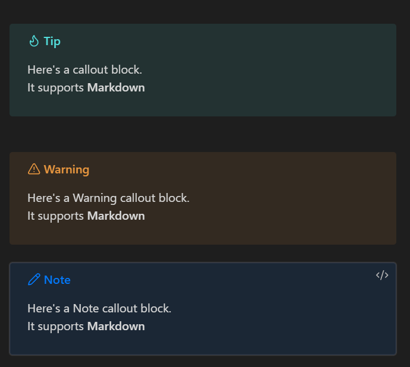

## General Tips for Easy Use

### Creating and Editing Notes

|syntax                  |Using Markdown syntax                                   |
|--------------------------------|-----------------------------------------------------|
| **Headings**                   | `# Heading 1` <br> `## Heading 2`                  |
| **Bold Text**                  | `**Bold text**`                                    |
| **Italic Text**                | `*Italic text*`                                    |
| **Bullet List**                | `- Bullet List`                                    |
| **Numbered List**              | `1. Numbered List`                                 |
| **Auto-save**                  | Notes are automatically saved.                     |

### Linking Notes
You can link notes using **double brackets**:
```md
[[Note Title]]
```
This creates a connection between notes.

### Using Callouts

If you want to make specific text or a paragraph in your notes stand out, use callout blocks in Obsidian.

1. Open a page and use the `/Insert callout` command.
2. Callout command is >[!tip]
2. Add **Tip**, **Warning**, or **Note** to denote a callout.
3. Insert a **Title** and content.
4. Hit **Enter** to view your callout block in your notes.

Example of the Code for Callout:
```
>[!tip]
> Here's a callout block.
> It supports **Markdown**
```


### Graph View

| Action                     | Description |
|----------------------------|-------------|
| **Open Graph View**        | Click on **Graph View** in the sidebar. |
| **Explore Connections**    | Interactively view links between different notes. |


### Plugins & Customization

| Feature            | Description |
|--------------------|------------|
| **Core & Community Plugins** | Obsidian offers both **core** and **community** plugins. |
| **Access Plugins** | Navigate to **Settings > Community Plugins**. |
| **Install Plugins** | Browse and install plugins to extend functionality. |
| **Customize Themes** | Modify themes under **Settings > Appearance**. |


### Keyboard Shortcuts Windows/Mac

| Action | Shortcut |
|--------|----------|
| Open Quick Switcher | `Ctrl/Cmd + O` |
| Create a New Note | `Ctrl/Cmd + N` |
| Open Command Palette | `Ctrl/Cmd + P` |
| Toggle Sidebar | `Ctrl/Cmd + E` |
| Preview Mode | `Ctrl/Cmd + Shift + E` |

### Exporting Notes

| Format  | Description |
|---------|------------|
| **Markdown (.md)** | Export notes in Markdown format. |
| **PDF (.pdf)** | Export notes as a PDF document. |
| **HTML (.html)** | Export notes as an HTML file. |
